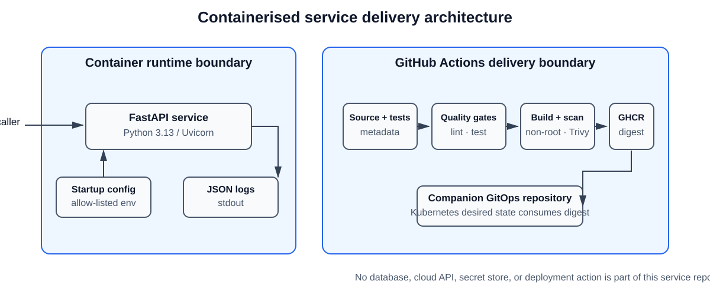
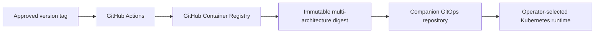

<!-- reader-first-readme:v1 -->

# Containerised Service with CI/CD

This repository contains a small Python HTTP service and the automated delivery
checks around it. The service is deliberately narrow: it demonstrates how
source code becomes a tested, secure, versioned container image that can be
consumed by a separate GitOps deployment repository.

The result is a small but complete delivery chain: a developer changes the
service, automated checks prove that it still works and meets its security
rules, and an approved version tag produces one immutable image for the
separate deployment repository.

## The 30-second overview

1. A developer changes the Python service and opens a pull request.
2. GitHub Actions formats, checks, tests, packages, and scans that change.
3. A semantic version tag such as `v0.1.3` starts the controlled release path.
4. The workflow publishes one image for Intel/AMD and Apple Silicon systems.
5. It records an immutable digest—an identifier that changes if any image byte
   changes—and supply-chain attestations.
6. The companion GitOps repository chooses when that exact digest should run.

## What it does

The service exposes three JSON endpoints:

| Endpoint | Purpose |
| --- | --- |
| `GET /health` | Confirm that the process is running and able to respond |
| `GET /version` | Identify the application version currently running |
| `GET /config-summary` | Show an allow-listed, non-sensitive configuration summary |

It reads configuration from environment variables, rejects invalid
configuration with a useful error, and emits structured JSON logs. Automated
tests cover endpoint responses, configuration behaviour, and error paths. The
same application runs locally and inside a Docker container.

## Why this is useful

These are common production-service patterns:

- Health endpoints let monitoring and container platforms determine whether a
  process is responding.
- Version endpoints help operators identify the deployed release.
- Environment variables let one immutable image run with different settings.
- An allow-listed configuration summary supports diagnosis without exposing
  secrets or dumping the process environment.
- Structured logs can be searched and analysed by log-processing systems.
- Containers provide a consistent application and dependency boundary.
- CI/CD checks detect defects, packaging errors, and known image vulnerabilities
  before an artifact is released.

The delivery path is:

```text
Python source
    -> formatting and linting
    -> automated tests
    -> container image build
    -> container security scan
    -> tag-triggered publication of a versioned artifact
```

This project is the application-delivery half of the companion
[Secure Container Delivery & GitOps case study](https://github.com/abdalrahmanattya/containerised-service-gitops).
It produces the immutable image consumed by the separate Kubernetes desired-
state repository.

## A complete operator journey

Suppose an engineer changes the `/version` endpoint. Before the change can be
trusted, the continuous integration (CI) workflow installs the locked project,
checks formatting and code quality, runs the endpoint tests, builds the same
Docker image users will run, confirms that it is not running as the all-powerful
root user, and scans its packages for known serious vulnerabilities.

Normal pushes and pull requests stop there: they cannot publish or deploy. Once
the change is reviewed and the maintainer approves a versioned release, pushing
a semantic tag runs those gates again and publishes to GitHub Container Registry
(GHCR). The companion GitOps repository references the resulting digest instead
of a moving name, so a later image cannot silently replace the reviewed one.

## System architecture diagram

In plain language, the diagram shows the boundaries between the Python process,
its container runtime, and the GitHub Actions delivery path. The GitOps repository consumes
the published digest; it is not changed by this repository's CI workflow.



The maintainable diagram source is
[`docs/diagrams/containerised-service-delivery.mmd`](docs/diagrams/containerised-service-delivery.mmd).
The runtime has no database, cloud API, or secret store. Configuration enters
only at startup, and logs leave through standard output.

### Runtime request flow

```mermaid
flowchart LR
  Caller[Person or health monitor] --> Port[Container port 8000]
  Port --> Server[Uvicorn web server]
  Server --> API[FastAPI application]
  Settings[Allow-listed environment settings] --> API
  API --> Health[/health]
  API --> Version[/version]
  API --> Summary[/config-summary]
  API --> Logs[Structured JSON logs on standard output]
```

A caller reaches Uvicorn, the production web server inside the container.
FastAPI selects the requested endpoint and returns a small JSON response. At
startup, the service accepts only documented configuration values. It never
returns the full process environment, request bodies, or secret-like values;
operational logs leave through standard output for the runtime to collect.

## API contract

Example successful responses are intentionally small and predictable:

```json
{"status":"healthy"}
```

```json
{"version":"0.1.3"}
```

```json
{
  "environment": "development",
  "log_level": "INFO",
  "service_name": "containerised-service"
}
```

The exact contract, defaults, and failure behaviour are defined in
[`docs/requirements.md`](docs/requirements.md).

## Technology guide in plain English

| Technology | Its job here |
| --- | --- |
| Python 3.13 | Runs the application code. |
| FastAPI | Defines the three web endpoints and their JSON responses. |
| Uvicorn | Listens for HTTP requests and passes them to FastAPI. |
| pytest | Repeats expected and error-path behavior as automated tests. |
| Ruff | Enforces consistent Python formatting and catches common code problems. |
| Docker | Packages the application and dependencies into one portable image. |
| GitHub Actions | Runs the versioned validation and publication workflows. |
| Trivy | Reports known vulnerabilities in the built container image. |
| GitOps | Keeps the desired deployment in a separate repository so application CI cannot silently change a running environment. |

## Run locally

Use Python 3.13 and run these commands from the repository root:

```sh
python3.13 -m venv .venv
.venv/bin/python -m pip install --upgrade pip
.venv/bin/python -m pip install -e '.[dev]'
.venv/bin/ruff format --check src tests
.venv/bin/ruff check src tests
.venv/bin/pytest
```

Start the local development server with:

```sh
.venv/bin/uvicorn containerised_service.main:app --reload
```

Then check the implemented endpoint:

```sh
curl http://localhost:8000/health
curl http://localhost:8000/version
curl http://localhost:8000/config-summary
```

The responses include `{"status":"healthy"}`, `{"version":"0.1.3"}`, and
the allow-listed configuration fields. The version comes from the package
metadata in `pyproject.toml`; it is not read from Git at runtime.

To run with valid overrides, set only the documented variables before startup:

```sh
SERVICE_NAME=payments-api APP_ENV=staging LOG_LEVEL=DEBUG \
  .venv/bin/uvicorn containerised_service.main:app --reload
```

Invalid values stop startup with a clear error. The service never returns the
complete process environment or secret-like variables.

The service also writes one JSON object per log line to standard output. A
request-completion record contains the method, path, status code, and duration;
request bodies and arbitrary environment variables are excluded.

## Local container usage

Build the image from the repository root:

```sh
docker build --tag containerised-service:0.1.3 .
```

Run it with the same configuration contract:

```sh
docker run --rm --name containerised-service \
  --publish 8000:8000 \
  --env SERVICE_NAME=containerised-service \
  --env APP_ENV=development \
  --env LOG_LEVEL=INFO \
  containerised-service:0.1.3
```

In another terminal, verify all endpoints:

```sh
curl http://127.0.0.1:8000/health
curl http://127.0.0.1:8000/version
curl http://127.0.0.1:8000/config-summary
```

The image runs as the non-root `app` user. Stop the foreground container with
`Ctrl-C`, or use `docker stop containerised-service` from another terminal.

## What was tested

The workflow in [`.github/workflows/ci.yml`](.github/workflows/ci.yml) runs on
pull requests and pushes to `main`. It installs the package and development
dependencies, checks Ruff formatting and lint, runs pytest, builds the Docker
image, verifies its non-root runtime, and scans the image with Trivy.

The scan fails on fixed `HIGH` or `CRITICAL` vulnerabilities and ignores only
unfixed findings. The exception process and required review details are in
[`docs/security.md`](docs/security.md). This validation workflow does not
publish or deploy; the separate release workflow repeats the quality and
security gates before publication.

The verified service has 14 automated tests covering endpoints, configuration,
startup failures, logging, and non-disclosure. The release evidence also covers
Ruff checks, an image build, non-root execution, zero fixed HIGH or CRITICAL
Trivy findings, and multi-architecture image publication. Hosted documentation
checks passed in run
[31696757416](https://github.com/abdalrahmanattya/containerised-service-cicd/actions/runs/31696757416).

## Versioned GHCR image publication

This tag-triggered workflow is the exact deployment method for publishing the
runtime artifact; deploying that artifact as a service belongs to the companion
GitOps repository.

The separate [`publish-image.yml`](.github/workflows/publish-image.yml)
workflow publishes only when a semantic-version Git tag such as `v0.1.3` is
pushed. It uses the short-lived GitHub Actions token and the minimum package
write permission; no personal registry token is required.

The verified v0.1.3 release image is:

```text
ghcr.io/abdalrahmanattya/containerised-service:0.1.3
```

The published v0.1.3 multi-architecture image is identified by this immutable
top-level digest:

```text
sha256:6a9075b289a699692f60f6936b84590c8ad487071145a909ae7c3de98025f3b2
```

The workflow records the immutable image digest in the run summary and enables
BuildKit provenance and SBOM attestations. The companion
[GitOps repository](https://github.com/abdalrahmanattya/containerised-service-gitops)
references this digest rather than a moving tag. Before publishing another
release, confirm the tag, repository ownership, package visibility, and
workflow permissions.

Publishing is intentionally not performed from a local terminal. It occurs
only through the reviewed tag workflow after explicit approval.

## Security boundaries and limitations

The current service does not include a database, authentication, a cloud API,
Kubernetes, or a production deployment. It must not store or reveal secrets.
The configuration summary exposes only explicitly approved fields.

Building and running a container is local. Configuring a Git remote,
publishing an image, adding credentials, or deploying the service are separate
actions and require explicit maintainer approval.

## Repository map

| Path | Purpose |
| --- | --- |
| `docs/requirements.md` | Agreed behaviour, acceptance criteria, and non-goals |
| `docs/architecture.md` | Components, data flow, and trust boundaries |
| `docs/development.md` | Local development, CI, and release workflows |
| `docs/issues/` | Ordered, bounded implementation issues |
| `docs/decisions/` | Durable decisions and their trade-offs |
| `src/containerised_service/` | Python application package |
| `tests/` | Automated tests |
| `pyproject.toml` | Package metadata, dependency pins, and tool configuration |
| `CHANGELOG.md` | Notable user-visible changes |
| `LICENSE` | MIT license for the repository |

## Cloud resources and deployment status

The verified `v0.1.3` release contains the documented service, non-root image,
quality gates, vulnerability-scan policy, and `linux/amd64` plus `linux/arm64`
image manifests. Its published digest is recorded above and is consumed by the
companion GitOps repository's Kubernetes desired state.

This repository does not define a cloud account or deploy a running service.
The runtime is a portable container: an operator can run it with Docker using
the commands above, or let the companion repository deploy the exact published
digest to Kubernetes. That separation is intentional—the application pipeline
produces evidence and an artifact, while deployment ownership stays elsewhere.



No AWS, Azure, or other cloud resources are planned or deployed by this
repository. The relevant hosted resource is GHCR, while the actual runtime is
selected and managed through the companion repository. Consequently no cloud
provider service icons apply to this diagram. Official provider icons are not
applicable; its neutral shapes are project-authored, and the earlier delivery
image is generated from the local
Mermaid source linked beside it.
